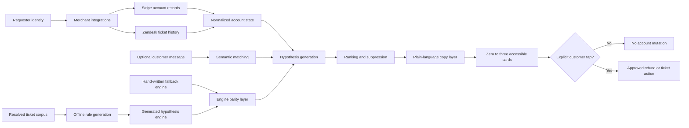

# Wordless

**Account-state-first customer support for people who cannot reliably describe the problem.**

> Traditional support asks the customer to explain what happened.  
> Wordless reads the account first, identifies what is probably wrong, and lets the customer point.

An estimated two million Americans live with aphasia. For many people with expressive aphasia, comprehension can remain substantially intact while word retrieval becomes difficult or unreliable.

That creates a structural problem: nearly every support system requires the customer to describe the issue before it will inspect the account.

**Wordless reverses that dependency.**

It reads the merchant’s existing records for the customer—orders, charges, refunds, subscriptions, and previous support tickets—then generates a ranked set of likely support issues.

The result is rendered as **zero to three large, plain-language, tappable cards**.

The customer does not need to produce the correct sentence.

**They only need to recognize the correct problem.**

For the full product rationale and implementation specification, see [`PROMPT.md`](PROMPT.md).

---

## The core idea

A conventional support system follows this sequence:

```text
customer description
        ↓
intent classification
        ↓
account lookup
        ↓
support action
```

Wordless follows a different sequence:

```text
merchant-owned account state
        ↓
support hypothesis generation
        ↓
optional language evidence
        ↓
ranked recognition cards
        ↓
explicit customer selection
        ↓
support action
```

The customer’s words are useful, but they are not required.

Conceptually, Wordless ranks each possible support reason using:

```text
rank(reason) = f(
  P(reason | account state),
  recency,
  semantic similarity,
  prior support history,
  contradictory evidence
)
```

The account state is the primary signal. The user’s message, when present, is additional evidence.

---

## Why this is different

| Description-first support | Wordless |
|---|---|
| Requires a usable sentence | Accepts incomplete, ambiguous, or empty input |
| Treats the message as the source of truth | Treats merchant-owned account state as the source of truth |
| Looks up records after classifying intent | Reads relevant records before asking the customer to choose |
| Optimizes for language production | Optimizes for recognition |
| Often asks repeated clarification questions | Produces at most three concrete possibilities |
| Can be fluent and confidently wrong | Must ground every hypothesis in account evidence |
| May take action inside a conversation | Requires an explicit card selection before any write |

Wordless is not trying to make a chatbot slightly more accessible.

It changes the direction of the support interaction.

---

## Quick start

```bash
npm install
npm run dev
```

The development server opens on port `3000` by default. Any available port works.

No API keys are required.

`DEMO_MODE` defaults to `true`, so the entire application runs offline using deterministic fixtures.

Run the executable product checks with:

```bash
npm run check
```

---

## Run with live integrations

Copy the environment template:

```bash
cp .env.example .env.local
```

Add the required provider credentials, start the application, and press:

```text
Cmd/Ctrl + D
```

This toggles the application between demo mode and live mode.

Every external integration has a timeout and a deterministic fallback. A provider failure should not produce a permanently loading interface, an unhandled error, or an unexplained empty state.

---

## Demo scenarios

### A — Golden path

Enter:

```text
order wrong the thing help
```

The legacy description-first agent interprets the message as a product-return problem and confidently explains the return policy.

Wordless inspects the account and surfaces:

> **You were charged twice**

The duplicate charge was not described by the customer. It was discovered from account state.

```text
Words: 4
Turns: 1
```

---

### B — Circumlocution

Enter:

```text
the boily thing broke
```

No keyword in that message matches the customer’s order record.

The semantic matching layer connects “the boily thing” with the kettle order using embedding similarity.

This is not treated as a spelling mistake. It demonstrates how Wordless handles circumlocution: describing an object indirectly when the intended noun cannot be retrieved.

---

### C — Zero words

Leave the text box empty and press:

```text
I need help
```

Wordless generates cards using only:

- account state
- transaction history
- support history
- recency
- hypothesis confidence

```text
Words: 0
Turns: 1
```

The text box is optional. The account is not.

---

## Stage controls

| Shortcut | Action |
|---|---|
| <kbd>Cmd</kbd>/<kbd>Ctrl</kbd> + <kbd>D</kbd> | Toggle demo and live modes |
| <kbd>Cmd</kbd>/<kbd>Ctrl</kbd> + <kbd>K</kbd> | Cycle customers: Maria → Sam → Jo |
| <kbd>Cmd</kbd>/<kbd>Ctrl</kbd> + <kbd>0</kbd> | Submit with zero words |
| <kbd>Esc</kbd> | Reset the current experience |

---

## System architecture



---

## Request lifecycle

### 1. Resolve the requester

Wordless uses the requester identity already associated with the support context.

The merchant’s connected systems are queried using that identity. Wordless does not ask the customer to search for order IDs or manually reconstruct account history.

---

### 2. Read merchant-owned account state

The integration layer reads relevant records such as:

- charges
- refunds
- subscriptions
- orders
- previous support tickets

These records replace information the customer may be unable to produce reliably.

---

### 3. Generate support hypotheses

The hypothesis engine evaluates the current account state and produces plausible ticket reasons.

A hypothesis must be supported by observable account evidence.

Healthy accounts should not receive speculative problems.

---

### 4. Add optional language evidence

When the customer enters text, Wordless uses it as an additional ranking signal.

The message can be:

- grammatically incomplete
- semantically indirect
- missing the intended noun
- unrelated to the actual account issue
- completely empty

The message does not override stronger account evidence simply because it resembles a familiar support keyword.

---

### 5. Rank and suppress

Candidate hypotheses are ranked using signals such as:

- account-state likelihood
- recency
- semantic similarity
- prior ticket history
- contradictory evidence

Low-confidence and unsupported results are suppressed.

The interface displays no more than three cards.

---

### 6. Rewrite for recognition

The final card copy is optimized for fast recognition rather than conversational fluency.

Cards should be:

- concrete
- short
- direct
- visually scannable
- free of unnecessary support terminology
- understandable without reading a paragraph

Examples of the intended shape:

```text
You were charged twice
```

```text
Your order did not arrive
```

```text
Your subscription is still active
```

The card should describe the problem, not explain the entire support workflow.

---

### 7. Require explicit consent

Reading account state and modifying account state are separate operations.

Wordless may inspect merchant-authorized records to suggest a problem, but it does not:

- issue a refund
- cancel or modify a subscription
- create a support ticket
- perform another account write

until the customer explicitly selects a card.

The card tap is the mutation boundary.

---

## Component responsibilities

### Composio

Implementation: [`lib/composio.ts`](lib/composio.ts)

Composio connects Wordless to the merchant’s operational systems.

It reads:

- Stripe charges
- Stripe refunds
- Stripe subscriptions
- Zendesk ticket history

It uses the requester email already associated with the support context.

It can also execute approved writes, such as issuing a refund or creating a ticket, but only after an explicit customer selection.

The merchant connects its own systems once.

**Wordless does not scan the customer’s inbox.**

---

### Octen

Implementation: [`lib/octen.ts`](lib/octen.ts)

Octen handles semantic matching when keyword search is insufficient.

For example:

```text
the boily thing
```

does not share a useful token with:

```text
kettle
```

The live semantic path uses `octen-embedding-4b` and cosine similarity to connect the indirect description with the relevant order.

The offline fallback ladder is:

```text
live embedding request
        ↓
precomputed embedding table
        ↓
token-overlap fallback
```

This keeps the application usable and deterministic when the external embedding service is unavailable.

---

### Generated hypothesis engine

Generator: [`scripts/generate-rules.ts`](scripts/generate-rules.ts)  
Generated engine: [`lib/hypotheses.generated.ts`](lib/hypotheses.generated.ts)  
Training corpus: [`data/ticket-corpus.json`](data/ticket-corpus.json)

The hypothesis engine is generated offline from 350 resolved support tickets.

The generation step:

1. clusters tickets by resolution
2. measures base scores as `P(reason | account state)`
3. extracts circumlocution variants from ticket bodies
4. emits deterministic ranking rules
5. commits the generated engine into the repository

The generated engine does not require a model call at runtime.

This keeps the critical decision path inspectable, repeatable, and testable.

---

### Hand-written hypothesis engine

Implementation: [`lib/hypotheses.ts`](lib/hypotheses.ts)

The hand-written engine is the committed fallback for the generated engine.

It provides:

- an independently implemented decision path
- a readable reference for expected behavior
- protection against generation regressions
- parity verification in the test suite

`npm run check` asserts that the generated and hand-written engines agree on the required fixtures.

---

### OpenAI

Implementation: [`lib/llm.ts`](lib/llm.ts)

The OpenAI layer has two constrained responsibilities.

#### Card-copy polishing

It rewrites supported hypotheses under strict aphasia-friendly copy rules.

The model does not decide whether an account problem exists. It receives an already grounded hypothesis and improves how that hypothesis is presented.

#### Legacy-agent simulation

It also simulates a conventional description-first support agent for comparison.

In the golden demo path, the legacy agent produces an answer that is:

- fluent
- plausible
- confident
- wrong

That contrast demonstrates the central product argument:

> Language confidence is not account evidence.

---

## The falsifiable claim

Wordless should not invent problems.

A healthy account must produce:

```text
0 hypotheses
```

An account with ticket-generating conditions should produce:

```text
2 or 3 hypotheses
```

The claim is executable:

```bash
npm run check
```

The check command:

1. feeds a clean fixture through both hypothesis engines
2. fails if either engine returns a hypothesis for the clean account
3. verifies the expected golden-path ranking
4. checks generated-engine and fallback-engine parity
5. verifies that judge-supplied input does not crash the pipeline

This is the core product claim expressed as code rather than marketing copy.

---

## Product invariants

The implementation is built around the following invariants:

```text
healthy account
    => zero cards
```

```text
ticket-generating account
    => two or three cards
```

```text
customer message
    => optional evidence
```

```text
unsupported hypothesis
    => suppressed
```

```text
explicit customer tap
    => required before any write
```

```text
external provider failure
    => deterministic fallback
```

```text
visible interface
    => never an unresolved spinner or unexplained empty screen
```

These invariants are more important than producing a conversational response.

---

## Reliability model

Wordless is designed to degrade deterministically.

| Dependency | Primary path | Fallback behavior |
|---|---|---|
| Account integrations | Live merchant-connected records | Deterministic demo fixtures |
| Semantic matching | `octen-embedding-4b` similarity | Precomputed table, then token overlap |
| Hypothesis generation | Generated rules | Hand-written committed engine |
| Card-copy polishing | Constrained model rewrite | Deterministic product copy |
| Support actions | Live approved write | No silent mutation |

Every external call has a timeout.

The customer should never be required to understand or recover from a provider-level error.

---

## Accessibility

Accessibility is not an interface enhancement in Wordless. It is the reason the interface exists.

The demo includes:

- Atkinson Hyperlegible Next, self-hosted
- no text smaller than `16px`
- large interaction targets
- semantic `<button>` elements
- visible keyboard focus indicators
- complete keyboard operation
- an `aria-live` region for generated cards
- support for `prefers-reduced-motion`
- zero axe-core violations

Automated accessibility testing is necessary, but it is not sufficient.

A support interface can pass an accessibility scanner and still require the customer to:

- retrieve the correct noun
- construct a complete sentence
- explain a sequence of events
- answer repeated clarification questions
- distinguish between similar support terminology

Wordless addresses that interaction-level failure.

---

## Privacy and consent boundaries

Wordless operates on merchant-authorized records.

It reads only the systems connected by the merchant and uses the requester identity already present in the support context.

It does not:

- scan personal inboxes
- search unrelated personal accounts
- infer issues from private communications
- mutate an account without a customer selection
- treat generated language as permission to act

The system separates three stages:

```text
read
  ↓
suggest
  ↓
act only after explicit selection
```

That separation is intentional.

---

## What Wordless is not

Wordless is not:

- a medical diagnostic tool
- an autonomous refund agent
- a general-purpose chatbot
- an inbox-scanning assistant
- a replacement for merchant authentication
- a system that assumes every account contains a problem
- a long menu of every possible support category

It is a constrained support inference layer designed to reduce the amount of language a customer must produce.

---

## Repository map

| Path | Responsibility |
|---|---|
| [`PROMPT.md`](PROMPT.md) | Full design rationale and build specification |
| [`lib/composio.ts`](lib/composio.ts) | Merchant record reads and approved support writes |
| [`lib/octen.ts`](lib/octen.ts) | Semantic matching and offline similarity fallbacks |
| [`lib/llm.ts`](lib/llm.ts) | Card-copy polishing and legacy-agent simulation |
| [`lib/hypotheses.generated.ts`](lib/hypotheses.generated.ts) | Generated runtime hypothesis engine |
| [`lib/hypotheses.ts`](lib/hypotheses.ts) | Hand-written fallback hypothesis engine |
| [`scripts/generate-rules.ts`](scripts/generate-rules.ts) | Offline rule-generation pipeline |
| [`data/ticket-corpus.json`](data/ticket-corpus.json) | Corpus of 350 resolved support tickets |

---

## Evaluate it in under a minute

Install and start the app:

```bash
npm install
npm run dev
```

Run the golden path:

```text
order wrong the thing help
```

Confirm that the description-first agent discusses the return policy while Wordless surfaces the duplicate charge.

Then test circumlocution:

```text
the boily thing broke
```

Then test zero-word support:

```text
Cmd/Ctrl + 0
```

Finally, run the executable invariants:

```bash
npm run check
```

The demo is successful when Wordless can identify a grounded support issue with less linguistic effort than the customer would need in a conventional support conversation.

---

## Design principle

Most support software treats language as the input and account data as supporting context.

Wordless treats account data as the input and language as optional context.

That inversion is the product.

> **The customer should not have to explain information the merchant already has.**
